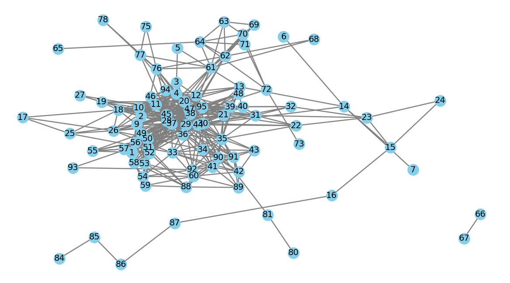

# Brain Connectivity Analysis using Graph Theory Metrics

## Overview
This project analyzes brain functional connectivity using **graph theory metrics** applied to **electrocorticography (ECoG) data**. It aims to characterize and compare brain network structures during **rest** and **movie-watching** states across six frequency bands (delta, theta, alpha, beta, gamma, and high gamma). The analysis is performed using Python, leveraging various libraries for graph construction, metric computation, statistical analysis, and visualization.

[📄 Read the project report](./report _final.pdf)

## Project Structure

### 1. **Graph Construction**
- **File:** `GraphBuild.py`
- **Description:**
  - Reads **coherence matrices** from CSV files.
  - Constructs **undirected weighted graphs**, where nodes represent electrodes and edges represent functional connectivity (coherence values).
  - Applies **thresholding** to retain the strongest **10% and 20%** of connections.
  - Saves graphs in **GraphML** format for further analysis.

### 2. **Graph Metrics Calculation**
- **File:** `GraphMetrics.py`
- **Description:**
  - Computes **global** and **node-level** graph theory metrics.
  - **Global Metrics:**
    - **Global Clustering Coefficient (GCC):** Measures network-wide clustering.
    - **Modularity:** Evaluates the strength of community structures.
  - **Node-Level Metrics:**
    - **Degree Centrality:** Number of direct connections per node.
    - **Node Clustering Coefficient (NCC):** Measures local clustering of nodes.
  - Saves computed metrics in a **pickle file (`graph_metrics.pkl`)**.

### 3. **Statistical Analysis**
- **File:** `SignificanceTester.py`
- **Description:**
  - Performs **paired t-tests** (for global metrics) and **Kolmogorov-Smirnov tests** (for node metrics) to compare **rest vs. movie-watching** conditions.
  - Determines statistical significance of observed differences.
  - Outputs results for further interpretation.

### 4. **Visualization**
- **Files:** `PlotResults.py`, `GraphPlotter.py`
- **Description:**
  - Generates **bar plots, histograms, and kernel density estimates (KDEs)** to visualize metric distributions across conditions.
  - Creates **heatmaps** and **network graphs** to illustrate connectivity patterns.
  - Outputs figures to help interpret network organization differences.

### 5. **Main Execution File**
- **File:** `MainClass.py`
- **Description:**
  - Orchestrates the execution of **graph metric computation, statistical tests, and visualization**.
  - Provides functions to run the full analysis pipeline.

## Installation
### Prerequisites
Ensure you have the following Python libraries installed:
```bash
pip install numpy networkx community gudhi scipy sklearn seaborn matplotlib pyvis pandas
```

## Usage
### 1. **Building Connectivity Graphs**
Run the graph construction script to generate and save thresholded connectivity graphs:
```bash
python GraphBuild.py
```

### 2. **Computing Graph Theory Metrics**
Calculate global and node-level metrics from the saved graphs:
```bash
python GraphMetrics.py
```

### 3. **Running Statistical Tests**
Compare brain network differences between rest and movie-watching states:
```bash
python SignificanceTester.py
```

### 4. **Visualizing Results**
Generate plots to explore clustering coefficients, modularity, and connectivity structures:
```bash
python PlotResults.py
```

### 5. **Full Execution**
Run the entire pipeline (graph building, metrics calculation, statistical analysis, and visualization):
```bash
python MainClass.py
```

## Results & Findings
- **Increased Global Clustering Coefficient (GCC) in the Gamma Band** during movie-watching, indicating enhanced integration across brain regions.
- **Higher Node Clustering Coefficients (NCC) in the Alpha, Beta, Gamma, and High-Gamma Bands**, suggesting increased local connectivity in cognitive tasks.
- No significant differences in **modularity** or **degree centrality**, implying stable brain community structure across conditions.

## Screenshots
### 1. **Graph Network Visualization**
Visual representation of a brain connectivity network:


### 2. **Global Clustering Coefficient Comparison**
Bar plot comparing GCC between rest and movie-watching states:


### 3. **Node Clustering Coefficient Density Plots**
Kernel Density Estimation (KDE) plots showing NCC distributions:


## References
- Kaiser, M. (2011). "A tutorial in connectome analysis: Topological and spatial features of brain networks."
- Berezutskaya, J., et al. (2022). "Open multimodal iEEG-fMRI dataset from naturalistic stimulation."
- Rubinov, M., & Sporns, O. (2010). "Complex network measures of brain connectivity."

---
### **Author:** Guy Baruch  
**Supervisor:** Dr. Yaara Erez, Neural Processing and Brain Networks Lab

